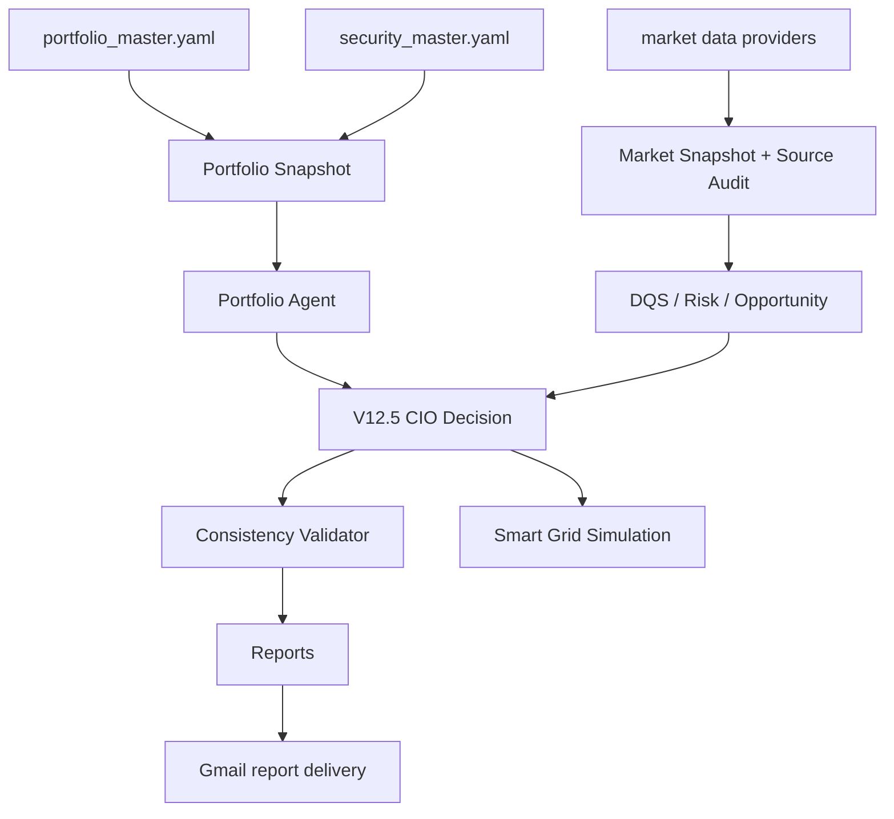

# ARCHITECTURE

## 唯一正式入口

```text
main.py -> src.app.main()
```

GitHub Actions、本地运行和测试均使用同一入口。

## 数据流



## 职责边界

- Codex负责数据抓取、清洗、资产台账、规则校验和候选建议。
- GPT/OpenAI只做解释、风险复核和冲突提示。
- AI不得覆盖DQS、现金安全线、资产配置、资金来源、网格风控和人工确认规则。

## 归档规则

旧入口已归档在 `archive/`，生产流程不得引用。
