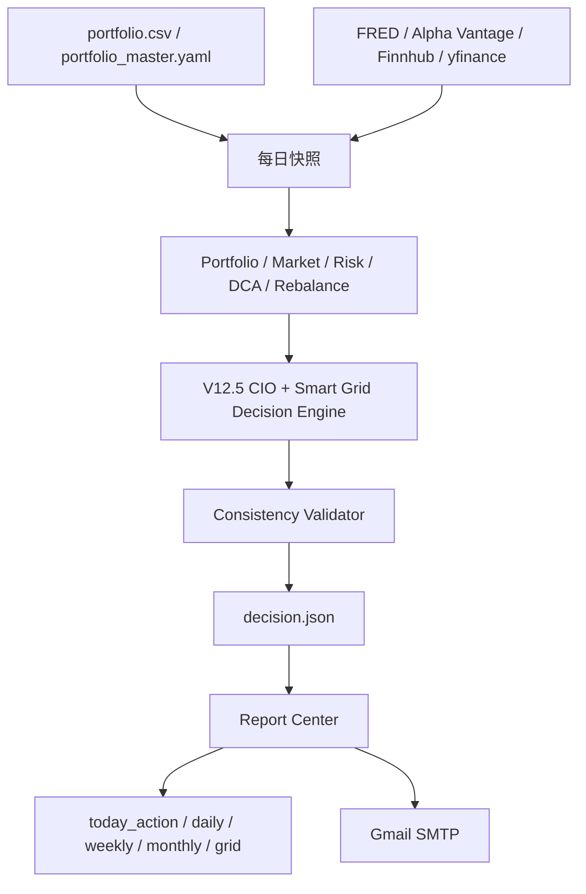

# Stone AI Project Audit

- 生成时间：2026-07-12T00:50:22
- 正式版本：Stone AI Investment Manager Pro V12.5 Stable
- 唯一正式入口：`python main.py`

## 1. 入口审计

- 正式入口：根目录 `main.py`。
- 核心业务逻辑：`src/app.py`。
- 旧 `src/main.py` 与 `run.py` 已移入 `archive/`，不再被正式流程调用。

## 2. 发现的历史入口
- 无

## 3. 正式数据流

## 4. 统一职责

- Codex：抓取、清洗、资产台账、执行状态、规则校验和候选建议。
- GPT/AI：CIO复核、风险判断、冲突仲裁和最终用户决策辅助。
- 决策层：任何报告和邮件必须读取统一 `decision.json`，不得各说各话。

## 5. DQS门槛

- DQS >= 85：允许正常金额建议。
- DQS 75-84：只允许金额区间和分批计划。
- DQS 60-74：只允许方向性建议。
- DQS < 60：禁止新增仓位建议。
- blocking_errors 非空：停止执行单。

## 6. 测试覆盖
- `tests/__init__.py`
- `tests/test_reliability.py`
- `tests/test_smart_grid.py`
- `tests/test_source_audit.py`
- `tests/test_v12_1_stable.py`
- `tests/test_v12_5_freeze.py`
- `tests/test_v12_5_stable.py`
- `tests/test_v12_decision_gates.py`
- `tests/test_v12_entrypoint.py`
- `tests/test_v12_reports_and_ai.py`

## 7. 文件概览

- Python文件数量：84
- main.py文件：main.py
- workflow/config文件数量：8
- report文件数量：13